<div align="center">


<h1>Design DNA</h1>

<p><strong>Reverse-engineer a visual design into evidence and an editable model — then adapt it without drift.</strong><br>
A Claude Code skill (<code>reverse-design</code>) backed by a deterministic measurement, rendering and verification engine.</p>

<p>
<a href="LICENSE"></a>


<a href="https://github.com/OzyAcc/design-dna/actions/workflows/acceptance.yml"></a>


</p>

<p>
<a href="#quick-start">Quick start</a> ·
<a href="#what-it-does">What it does</a> ·
<a href="#how-it-works">How it works</a> ·
<a href="#verified-results">Verified results</a> ·
<a href="#the-honesty-contract">Honesty contract</a> ·
<a href="#commands">Commands</a> ·
<a href="#roadmap">Roadmap</a>
</p>

</div>

---

"Make it like this" usually produces something with a similar *mood* and a hundred silent differences. Design DNA
does the opposite: it **measures** a reference — grid, frames, baselines, font size and tracking, role colours,
shadows, image grading, corner radii — stores every value with the evidence behind it, rebuilds the design as a live
editable model, and then lets you change one thing while **proving** that nothing else moved.

It never upgrades a guess into a fact. Measured, inferred and unknown values stay labelled; a font it cannot verify
stays *unknown* even when a candidate looks right; a rebuild that is really the original bitmap pasted behind text is
rejected as not editable.

## Quick start

**As a Claude Code plugin**

```text
/plugin marketplace add OzyAcc/design-dna
/plugin install design-dna@design-dna
```

**Or install the skill directly**

```bash
git clone https://github.com/OzyAcc/design-dna
cd design-dna
./install.sh          # Windows PowerShell: .\install.ps1
```

Requirements: Python 3.10+, and Google Chrome or Microsoft Edge (or `python -m playwright install chromium`).
The installer copies the skill to `~/.claude/skills/reverse-design`, installs the Python dependencies and prints a
capability report.

Then, in Claude Code:

```text
Scan poster.png and save it as "Editorial Product Spotlight". Rebuild it, then make an Arabic
version with my bag photo and a yellow accent — keep everything else.
```

## What it does


| | |
|---|---|
| **Scan** | 16 scan categories, from canvas metadata to message mechanism, each `observed / measured / inferred / unknown / not_applicable`, with an annotated reference and a coverage report. |
| **Measure** | ink bounds, projection-profile grids, sharp-edge scanlines that ignore soft shadows, least-squares corner radii, joint multi-probe shadow fits, role colours (patch, ink-core, gradient). |
| **Typography** | candidate fonts ranked by ink IoU with contact sheets; size, tracking, x and baseline render-fitted per candidate. Identity stays `unknown` without source evidence. |
| **Model** | a versioned scene (JSON Schema 2020-12): nodes, role tokens, content-hashed assets, slots, constraints, locks, communication hypotheses, per-property provenance. |
| **Render** | SVG master → PNG in a pinned Chromium (DPR 1, sRGB, fonts from files, `font-synthesis:none`, seeded grain). HarfBuzz shaping and bidi for Arabic. |
| **Verify** | exact pixels, MAE/RMSE, SSIM per region, ΔE2000, geometry, content, editability — profiles `exact_pixels`, `editable_close`, `adapt_preserve`, `reflow_preserve`. |
| **Adapt** | typed transactions (`set`, `replace`, `move`, `adapt`, `reflow`, …) with hard/soft locks and constraints; immutable revisions; undo; PNG + SVG export. |


## How it works

```mermaid
flowchart LR
    R[Reference image] --> A[Intake<br/>hash · metadata · sRGB copy]
    A --> S[8-pass scan<br/>measure.py · sample_colors.py<br/>font_candidates.py · fit_text.py]
    S --> E[(Evidence store<br/>method · tool · status · confidence)]
    S --> M[Scene model<br/>nodes · tokens · slots · locks]
    E -.provenance.- M
    M --> V{validate_model.py}
    V --> RD[render_static.py<br/>SVG master → PNG]
    RD --> C[compare_render.py<br/>metric panel · heatmap · crops]
    C -->|readiness| P[Template passport]
    P --> U[use … for task]
    U --> T[Typed transaction<br/>locks · constraints · dependencies]
    T --> RD
    T -->|verified| REV[Immutable revision<br/>undo · export]
```



Templates live outside the skill in `~/design-dna/templates/<id>/` (source bytes, content-hashed assets, evidence,
passport, scene, baseline renders, variants with every revision and transaction). Retrieval always reads files,
never conversation memory.

## Verified results

The acceptance suite executes **14 demonstrations** in an isolated store and keeps every input and output
(`skills/reverse-design/tests/run_acceptance.py`, ~15 minutes on Windows). Latest run: **14/14**.


| # | Demonstration | Result |
|---|---|---|
| 1 | Rebuild a known layered reference from pixels; score recovered parameters against hidden ground truth | ✅ |
| 2 | Scan an unfamiliar flattened JPEG; keep font uncertainty; measured editable baseline | ✅ |
| 3 | Duplicate-looking fonts: identity stays unknown until source evidence names the file | ✅ |
| 4 | Change only a headline: zero changed pixels outside the declared influence | ✅ |
| 5 | Swap the hero asset: treatment, mask, anchor kept; double shadow prevented | ✅ |
| 6 | Swap a colour token: all and only bound uses change; translucent consequence reported | ✅ |
| 7 | Impossible fit under fixed constraints: conflict + options, nothing shrunk or clipped | ✅ |
| 8 | Mixed Arabic/English headline: glyph coverage, shaping, bidi, punctuation | ✅ |
| 9 | Reflow 4:5 → 9:16: reading order, margins, fit preserved | ✅ |
| 10 | Same model rendered twice (incl. seeded grain): pixel-identical | ✅ |
| 11 | Undo restores the exact model; a fresh process reloads and re-renders identically | ✅ |
| 12 | Unsupported effect / adapter and missing asset return explicit statuses | ✅ |
| 13 | Reference-bitmap shortcut cannot pass as editable | ✅ |
| 14 | A wrong word or a 3 px logo shift fails despite global SSIM ≥ 0.998 | ✅ |


The full engineering log — what was built, what broke during acceptance and how it was fixed — is in
[docs/BUILD-REPORT.md](docs/BUILD-REPORT.md).

## The honesty contract

| Claim | Proven by | Never implies |
|---|---|---|
| Byte identity | sha256 / byte compare | editability |
| Decoded pixel identity | zero unequal pixels under a declared decode/colour/alpha policy | original layers |
| Editable visual reconstruction | recreated elements within tolerances declared before iterating | the designer's source |
| Adaptation fidelity | requested changes verified, invariants held | whole-image identity |
| Communication fidelity | an interpretation rubric | audience response |

- No promise of 100% editable recovery from a flattened image. Pixel identity is claimed only after a
  zero-difference compare, together with *how* it was achieved.
- Every check returns `pass`, `fail` or `unknown`; unknown never counts as a pass.
- SSIM is one measurement, not a percentage of identity.
- Opacity and colour of a blended shadow or overlay are recorded as a family, not a single fake value.
- Brands are never imposed on a reference unless the task asks.

Details: [`references/fidelity-contract.md`](skills/reverse-design/references/fidelity-contract.md).

## Commands

Natural language is compiled into a formal, replayable syntax (`dna.py -f session.dna`):

```text
scan reference.png as "Editorial Product Spotlight"
inspect "Editorial Product Spotlight" aspect typography
reconstruct "Editorial Product Spotlight" mode editable
use "Editorial Product Spotlight" for task "Launch this handbag"
lock layout,typography,background
set headline.content = "Made for every day."
set tokens.accent.primary = "#FFD400"
replace hero.asset with bag.png preserve treatment,crop-intent,anchor
adapt language=ar headline="صُنعت لكلّ يوم" font="NotoSansArabic-Bold.ttf"
reflow canvas=1080x1920 preserve margins-ratio,reading-order
compare against baseline
export formats=png,svg
undo last
save as "Everyday Bag — Yellow Variant"
```

Full grammar and transaction rules: [`references/command-contract.md`](skills/reverse-design/references/command-contract.md).

## Capabilities

| Implemented | Explicitly unsupported (returns `unsupported`) |
|---|---|
| Static raster references (PNG, JPEG, WebP, TIFF, BMP, GIF frame 1) | PDF, PSD / Figma / AI source, live UI capture |
| Live text, images, shapes, paths, groups, masks, gradients | Motion and timing, packaging dielines, 3D |
| Treatments: grayscale, saturate, contrast, brightness, hue, tint, blur | Bevel/emboss, inner shadow, glow, text on a path |
| Drop shadow, layer blur, blend modes, seeded grain, vignette | OCR engine (transcription is labelled manual observation) |
| Arabic and bidi via Chromium/HarfBuzz | Automatic segmentation and unknown-font identification |

Run `python skills/reverse-design/scripts/capabilities.py` to see what your machine can do.
Adapter details: [`references/adapters.md`](skills/reverse-design/references/adapters.md).

## Repository layout

```text
design-dna/
├── .claude-plugin/              plugin + marketplace manifests
├── skills/reverse-design/       the skill (installable on its own)
│   ├── SKILL.md                 triggers, rules, workflow
│   ├── references/              scan, scene, command, fidelity, adapter contracts
│   ├── schemas/                 scene · evidence · template · patch (JSON Schema 2020-12)
│   ├── scripts/                 engine: intake, measurement, render, compare, transactions, CLI
│   └── tests/                   acceptance suite + deterministic fixtures
├── docs/                        BUILD-REPORT.md, SPEC.md, images, image generator
└── .github/                     CI (lint + Windows acceptance), issue/PR templates
```

## Platform notes

- Verified on Windows 10 with Python 3.12, Chrome 154 and Edge 154 (CI: Windows Server, preinstalled Chrome). The engine is pure Python + Chromium and
  should run on macOS/Linux; the acceptance suite currently relies on Windows system fonts (Arial, Georgia, …).
- Fonts are never bundled. Templates reference font files on your machine by hash; exported SVG masters need the
  same fonts installed in design tools that ignore `@font-face`.

## Roadmap

- PDF adapter (embedded fonts and vectors as source evidence → verified font identity)
- Layered-source adapters (SVG, Figma export) and website/UI state capture
- OCR provider integration behind the capability interface
- Cross-platform acceptance fixtures with open-licensed fonts (Linux/macOS CI)
- Distribute-style reflow policy (fill vertical space instead of anchoring to edges)

## Contributing

Issues and pull requests are welcome. Read [CONTRIBUTING.md](CONTRIBUTING.md): every new capability ships with an
acceptance demonstration, and nothing may claim more than its evidence supports.

## Credits

- Built from the Design DNA build specification ([docs/SPEC.md](docs/SPEC.md)).
- Evidence-provenance, declared-capability and pass/fail/unknown ideas are inspired by
  [REA — Reverse Engineer Anything](https://github.com/morluto/rea), which investigates software rather than visual design.
- Stands on [Playwright](https://playwright.dev), [scikit-image](https://scikit-image.org), [fontTools](https://github.com/fonttools/fonttools),
  [Pillow](https://python-pillow.org), [SciPy](https://scipy.org) and [jsonschema](https://github.com/python-jsonschema/jsonschema).

## License

[MIT](LICENSE)
