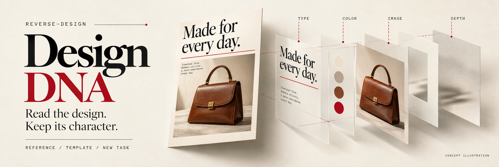
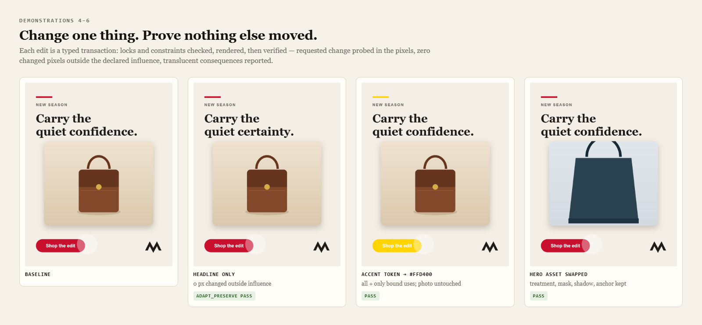
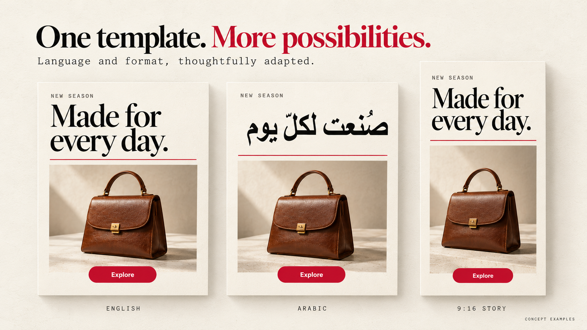
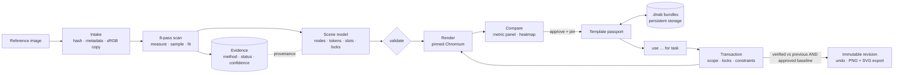
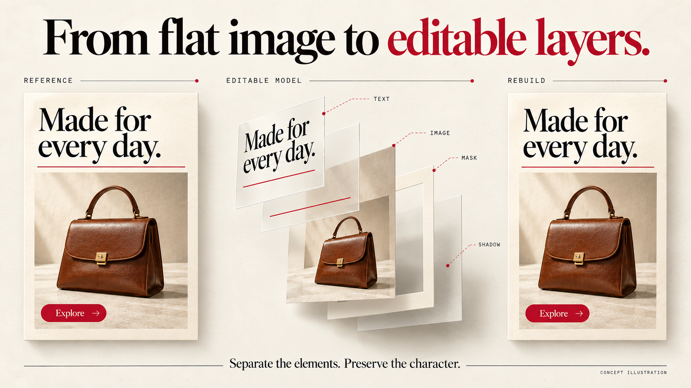
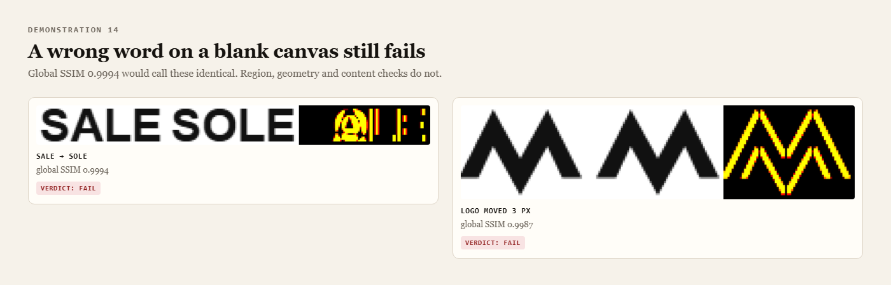
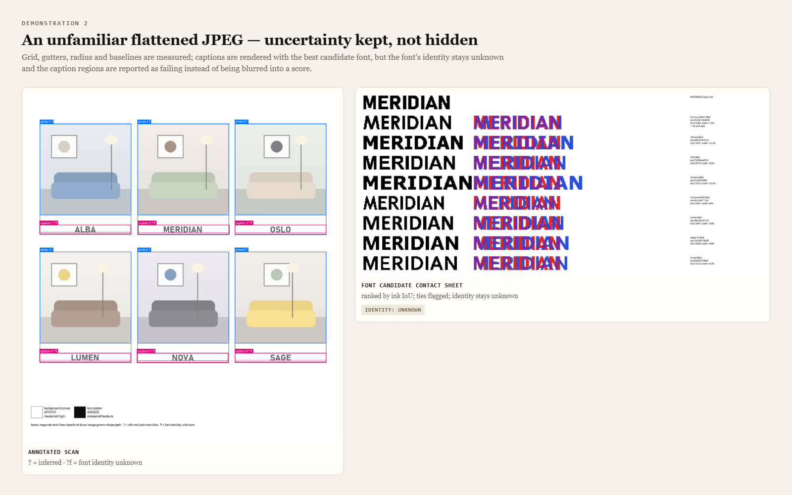

<div align="center">



<h1>Design DNA</h1>

<p><strong>Reverse-engineer a visual design into evidence and an editable model — then adapt it without drift.</strong><br>
A Claude Code skill (<code>reverse-design</code>) backed by a deterministic measurement, rendering and verification engine.</p>

<p>
<a href="LICENSE"></a>


<a href="https://github.com/OzyAcc/design-dna/actions/workflows/acceptance.yml"></a>


</p>

<p>
<a href="#quick-start">Quick start</a> ·
<a href="#what-it-does">What it does</a> ·
<a href="#how-it-works">How it works</a> ·
<a href="#verified-results">Verified results</a> ·
<a href="#the-honesty-contract">Honesty contract</a> ·
<a href="#commands">Commands</a> ·
<a href="CAPABILITIES.md">Capabilities</a>
</p>

</div>

---

> The images in this README are **concept illustrations** of the workflow, not engine output. Measured outputs are in
> the acceptance evidence screenshots ([v2.0.0](docs/images/evidence/v2.0.0/), [v1.0.0](docs/images/evidence/v1.0.0/)),
> the [build report](docs/BUILD-REPORT.md) and the `acceptance-evidence` artifact of every CI run.

"Make it like this" usually produces something with a similar *mood* and a hundred silent differences. Design DNA
works the other way. It **measures** a reference: grid, frames, baselines, font size and tracking, role colours,
shadows, image grading, corner radii. It stores every value with the evidence behind it, rebuilds the design as a
live editable model, and then lets you change one thing while **proving** that nothing else moved.

It never upgrades a guess into a fact. Measured, inferred and unknown values stay labelled. A font it cannot
verify stays *unknown*, even when a candidate looks right. A rebuild that is really the original bitmap pasted
behind text is rejected as not editable.

## What's new in 2.0

- **Templates that travel.** Export a template as one integrity-checked `.dnab` bundle, then delete the working
  folder. Import it anywhere, find it by name or id, and it re-renders to identical pixels.
- **A pinned renderer.** Once a baseline is approved, a different browser or version stops work (`renderer_drift`)
  until you review and confirm a migration.
- **"Keep everything else" that means it.** The edit you asked for and its dependencies are the only allowed
  changes. Each change is checked against the previous revision *and* the approved template baseline, with model
  changes and pixel changes reported separately.
- **An SVG export that tells the truth.** A manifest says which elements are live text, vectors, embedded rasters
  or filter effects, and the exported file itself is rendered and compared.
- **Deeper scan evidence.** Required facets per category, each with source, method, confidence and ambiguity.
  Communication stays hypothesis, never measurement.
- **Every finding of an independent audit fixed**, each with its own regression check
  ([docs/AUDIT-RESPONSE.md](docs/AUDIT-RESPONSE.md)).

Full list: [CHANGELOG.md](CHANGELOG.md).

## Quick start

**As a Claude Code plugin**

```text
/plugin marketplace add OzyAcc/design-dna
/plugin install design-dna@design-dna
```

**Or install the skill directly**

```bash
git clone https://github.com/OzyAcc/design-dna
cd design-dna
./install.sh          # Windows PowerShell: .\install.ps1
```

Requirements: Python 3.10+, and Google Chrome or Microsoft Edge (or `python -m playwright install chromium`).
The installer copies the skill to `~/.claude/skills/reverse-design`, installs the Python dependencies and prints a
capability report. Details, exact tested versions and the release ZIP: [INSTALL.md](INSTALL.md).

Then, in Claude Code:

```text
Scan poster.png and save it as "Editorial Product Spotlight". Rebuild it, then make an Arabic
version with my bag photo and a yellow accent — keep everything else.
```

## What it does



| | |
|---|---|
| **Scan** | 16 categories with required facets, from canvas metadata to message mechanism. Each finding is `observed / measured / inferred / unknown / not_applicable` with source, confidence and ambiguity, plus an annotated reference and a coverage report. |
| **Measure** | Ink bounds and projection-profile grids. Sharp-edge scanlines that ignore soft shadows. Least-squares corner radii, joint multi-probe shadow fits, role colours (patch, ink-core, gradient). |
| **Typography** | Candidate fonts ranked by ink IoU, with contact sheets. Size, tracking, x and baseline render-fitted per candidate. Identity stays `unknown` without source evidence. |
| **Model** | A versioned scene (JSON Schema 2020-12): nodes, role tokens, content-hashed assets, slots, constraints, locks, communication hypotheses, per-property provenance. |
| **Render** | Pinned Chromium (DPR 1, sRGB, fonts from hashed files, `font-synthesis:none`, seeded grain, network blocked). HarfBuzz shaping and bidi for Arabic. |
| **Verify** | RGBA identity, MAE/RMSE, SSIM per region, ΔE2000, geometry, content, editability. Profiles: `exact_pixels`, `editable_close`, `adapt_preserve`, `reflow_preserve`, `svg_roundtrip`. Missing evidence → `incomplete`. |
| **Adapt** | Typed transactions (`set`, `replace`, `move`, `adapt`, `reflow`, …) with property and pixel locks, constraints and keep-everything-else scopes. Immutable revisions, undo. |
| **Persist** | Portable `.dnab` bundles: export, validate, import, library lookup by id/name. PNG + self-contained SVG export with a manifest. |



## How it works



The working store (`~/design-dna`) is a cache. Templates persist as bundles in whatever storage you choose
([storage](skills/reverse-design/references/storage.md)). Retrieval always reads files, never conversation memory.

## Verified results

The acceptance suite runs in an isolated store and keeps every input and output
(`skills/reverse-design/tests/run_acceptance.py`, about 30 minutes on Windows). Latest run: **32/32 passed, 1 entry
unverified by design**. Results are grouped by kind, so a pass never hides what kind of claim it supports.



| # | Check | Kind | Result |
|---|---|---|---|
| 1 | Rebuild a layered reference from its flattened PNG + the supplied photo, logo and candidate fonts; parameters scored against hidden ground truth; `editable_close` asserted | reconstruction | ✅ |
| 2 | Scan an unfamiliar JPEG drawn by another rasterizer (operator reads captions + grid shape); uncertainty kept | honest partial result | ✅ |
| 3 | Duplicate-looking fonts: identity stays unknown until source evidence names the file | identity guard | ✅ |
| 4 · 5 · 6 | Headline-only edit · hero swap (double shadow prevented) · colour token swap | preservation | ✅ |
| 7 | Impossible fit under fixed constraints: conflict + options, nothing shrunk or clipped | expected rejection | ✅ |
| 8 | Mixed Arabic/English headline: glyph coverage, shaping, bidi, punctuation | adaptation | ✅ |
| 9 | Reflow 4:5 → 9:16: reading order, margins, fit | reflow | ✅ |
| 10 · 11 | Same model rendered twice is pixel-identical · undo + fresh-process reload | determinism · persistence | ✅ |
| 12 · 13 · 14 | Unsupported features return explicit statuses · reference-bitmap shortcut rejected · a wrong word or 3 px shift fails despite SSIM ≥ 0.998 | expected rejection | ✅ |
| 15 | "Move the headline up 3 px and keep everything else" | preservation | ✅ |
| 16 | An explicit lock conflicts with a keep-everything-else edit; pixel locks | expected rejection | ✅ |
| 17 | Long-text overflow, Arabic shaping, missing glyphs, tracked Arabic | expected rejection | ✅ |
| 18 · 19 | Accent token isolation · image replacement keeps crop intent, mask, treatment, shadow handling | preservation | ✅ |
| 20 | Bundle export → delete the working folder → find by name/id → import → identical re-render | portability | ✅ |
| 21 | Real Chrome ↔ Edge switch: drift detected, edits refused, migration previewed then confirmed | renderer integrity | ✅ |
| 22 | Exported SVG: declared contents, self-contained, rendered on its own and compared | export integrity | ✅ |
| 23 | Host persistent storage adapter (e.g. ChatGPT Work) | unverified integration | ⚪ unverified |
| 24–33 | One regression per audit finding: empty scans, crop assemblies, lock bypasses, hostile model data, RGBA, cache relocation, EXIF 5–8, text stroke, immutable baselines, OCR claim | audit regression | ✅ |





The engineering log (what was built, what broke during acceptance and how it was fixed) is in
[docs/BUILD-REPORT.md](docs/BUILD-REPORT.md). What is implemented, tested, partial or unsupported:
[CAPABILITIES.md](CAPABILITIES.md).

## The honesty contract

| Claim | Proven by | Never implies |
|---|---|---|
| Byte identity | sha256 / byte compare | editability |
| Decoded pixel identity | zero unequal **RGBA** pixels under a declared decode/colour policy | original layers |
| Editable visual reconstruction | recreated elements within tolerances declared before iterating, complete scan, editable slots | the designer's source |
| Adaptation fidelity | requested changes probed in pixels; everything else unchanged against the approved baseline | whole-image identity |
| Communication fidelity | an interpretation rubric | audience response |

- There is no promise of 100% editable recovery from a flattened image. Pixel identity is claimed only after a
  zero-difference compare, together with *how* it was achieved.
- Every check returns `pass`, `fail` or `unknown`. Unknown never counts as a pass, and missing evidence makes the
  verdict `incomplete`.
- SSIM is one measurement, not a percentage of identity.
- Opacity and colour of a blended shadow or overlay are recorded as a family, not a single fake value.
- The SVG export is not the editable master; the scene model is.
- Brands are never imposed on a reference unless the task asks for it.

Details: [`references/fidelity-contract.md`](skills/reverse-design/references/fidelity-contract.md).

## Commands

Natural language is compiled into a formal, replayable syntax (`dna.py -f session.dna`):

```text
scan reference.png as "Editorial Product Spotlight"
inspect "Editorial Product Spotlight" aspect typography
reconstruct "Editorial Product Spotlight" mode editable
use "Editorial Product Spotlight" for task "Launch this handbag"
move headline by x=0px y=-3px keep everything else
set tokens.accent.primary = "#FFD400" keep everything else
replace hero.asset with bag.png preserve treatment,crop-intent,anchor,mask,effects keep everything else
lock pixels 40,1180,220,90
adapt language=ar headline="صُنعت لكلّ يوم" font="NotoSansArabic-Bold.ttf"
reflow canvas=1080x1920 preserve margins-ratio,reading-order
export formats=png,svg
export-template "Editorial Product Spotlight" to D:/design-library
fetch "Editorial Product Spotlight" from D:/design-library
migrate-baseline "Editorial Product Spotlight"
undo last
save as "Everyday Bag — Yellow Variant"
```

Full grammar and transaction rules: [`references/command-contract.md`](skills/reverse-design/references/command-contract.md).

## Capabilities at a glance

| Implemented and tested | Explicitly unsupported (returns `unsupported`) |
|---|---|
| Static raster references (PNG, JPEG, WebP, TIFF, BMP, GIF frame 1), EXIF 1–8, ICC → sRGB | PDF, PSD / Figma / AI source, live UI capture |
| Live text (incl. stroke), images, shapes, paths, groups, masks, gradients | Motion and timing, packaging dielines, 3D |
| Treatments: grayscale, saturate, contrast, brightness, hue, tint, blur | Bevel/emboss, inner shadow, glow, text on a path |
| Drop shadow, layer blur, blend modes, seeded grain, vignette | OCR engine (transcription is labelled manual observation) |
| Arabic and bidi via Chromium/HarfBuzz | Automatic segmentation and unknown-font identification |
| Bundles, renderer pin + migration, verified SVG export | Host storage adapter: **unverified** |

The scan is **operator-assisted**: Claude proposes elements, transcribes text and reads communication, and the
tools measure. Full table with test ids: [CAPABILITIES.md](CAPABILITIES.md). Run
`python skills/reverse-design/scripts/capabilities.py` to see what your machine can do.

## Repository layout

```text
design-dna/
├── .claude-plugin/              plugin + marketplace manifests
├── skills/reverse-design/       the skill (installable on its own)
│   ├── SKILL.md                 triggers, rules, workflow
│   ├── references/              scan, scene, command, fidelity, adapter, storage contracts
│   ├── schemas/                 scene · evidence · template · patch · bundle (JSON Schema 2020-12)
│   ├── scripts/                 engine: intake, measurement, render, compare, transactions, bundles, CLI
│   └── tests/                   acceptance suite, audit regressions, deterministic fixtures
├── docs/                        BUILD-REPORT, AUDIT-RESPONSE, CHATGPT-WORK, SPEC, images, image generator
├── CAPABILITIES.md · INSTALL.md · CHANGELOG.md · requirements-lock.txt
└── .github/                     CI (lint, Windows + Linux acceptance), issue/PR templates
```

## Platform notes

- Verified on Windows 10 with Python 3.12, Chrome 154 and Edge 154 (CI: `windows-latest`, preinstalled browsers).
  The engine is pure Python + Chromium and should run on macOS/Linux, but the acceptance fixtures currently use
  Windows system fonts (Arial, Georgia, Bahnschrift, …).
- The only font files in the repository are the acceptance suite's open-licensed test fonts
  ([tests/fonts](skills/reverse-design/tests/fonts/README.md)). Bundles can embed fonts (check the licences before
  sharing) or reference them by sha256 so they resolve from local font folders.
- Reviewing or adapting the package for ChatGPT Work or another agent host: [docs/CHATGPT-WORK.md](docs/CHATGPT-WORK.md).

## Roadmap

- Host storage adapters (ChatGPT Work, cloud drives) behind `StorageBackend`, each with an acceptance test
- PDF adapter (embedded fonts and vectors as source evidence → verified font identity)
- Layered-source adapters (SVG, Figma export) and website/UI state capture
- OCR provider integration behind the capability interface
- Distribute-style reflow policy (fill vertical space instead of anchoring to edges)

## Contributing

Issues and pull requests are welcome. Read [CONTRIBUTING.md](CONTRIBUTING.md): every new capability ships with an
acceptance demonstration, and nothing may claim more than its evidence supports.

## Credits

- Built from the Design DNA build specification ([docs/SPEC.md](docs/SPEC.md)).
- The 2.0 hardening follows an independent repository audit ([docs/AUDIT-RESPONSE.md](docs/AUDIT-RESPONSE.md)).
- Evidence provenance, declared capabilities and pass/fail/unknown are ideas inspired by
  [REA — Reverse Engineer Anything](https://github.com/morluto/rea), which investigates software rather than visual design.
- Stands on [Playwright](https://playwright.dev), [scikit-image](https://scikit-image.org), [fontTools](https://github.com/fonttools/fonttools),
  [Pillow](https://python-pillow.org), [SciPy](https://scipy.org) and [jsonschema](https://github.com/python-jsonschema/jsonschema).

## License

[MIT](LICENSE)
