# Design DNA dashboard

A web app around the Design DNA engine. You turn designs you like into measured, rebuilt templates, keep them in a
library, copy and edit them with verified changes, and generate product outputs in batches, where each output has
its own copy. Every result says what was actually checked.

- **Web app:** React + TypeScript (`web/`), served by the API in production.
- **API:** FastAPI (`server/dna_dashboard/`) with SQLite storage (WAL, schema migrations).
- **Worker:** a separate process (`python -m dna_dashboard worker`). It runs a durable job queue with leases,
  heartbeats, cancellation and restart recovery.
- **Engine:** the repository's `skills/reverse-design` scripts. Every engine call runs in its own subprocess with
  an explicit, isolated store.
- **Providers (optional):**
  - Claude (Anthropic API) for proposed scan elements, copy drafts and free-text edit compilation.
  - OpenAI GPT Image for creative generation.

  Without keys, everything else works: intake, manual scanning, measurement, rebuild, editing, editable adaptation
  and exports.

Status, evidence and limits are in [docs/DASHBOARD-REPORT.md](../docs/DASHBOARD-REPORT.md).

## Run it locally

Requirements: Python 3.12+, Node 22+, and Chromium (Playwright's, or an installed Chrome or Edge).

```bash
python -m pip install -r dashboard/requirements.txt
python -m playwright install chromium          # skip if Chrome or Edge is installed
(cd dashboard/web && npm ci && npm run build)  # builds the web app into dashboard/web/dist
cd dashboard/server
python -m dna_dashboard all                    # API + web app on http://127.0.0.1:8765, worker as a child process
```

Open **http://127.0.0.1:8765**. Data goes to `~/design-dna-dashboard` (override it with `DNA_DATA_DIR`).

For production-like use, run the processes separately. You can run more than one worker:

```bash
python -m dna_dashboard serve     # web app + API
python -m dna_dashboard worker    # job worker (DNA_WORKER_THREADS threads, default 2)
python -m dna_dashboard check     # runtime report: renderer, libraries, providers, data directory
python -m dna_dashboard migrate   # create or upgrade the database schema
```

To work on the frontend, run `npm run dev` in `dashboard/web`. It serves on http://127.0.0.1:5173 and proxies
`/api` to port 8765.

## Run it in a container

```bash
cp dashboard/.env.example dashboard/.env       # set DNA_AUTH_TOKEN; provider keys are optional
docker compose -f dashboard/docker-compose.yml up --build
```

Open **http://127.0.0.1:8765** and sign in with `DNA_AUTH_TOKEN`.

Compose runs the web app and a separate worker on one named volume (`dna-data` → `/data`). Templates, versions,
outputs and the database survive restarts and rebuilds. The image is based on Playwright's official Python image
(Ubuntu 24.04, Chromium and its system libraries). To build it alone:
`docker build -f dashboard/Dockerfile -t design-dna-dashboard .`

## Configuration

Every setting is an environment variable. `.env.example` lists them all.

| Variable | Default | Meaning |
|---|---|---|
| `DNA_DATA_DIR` | `~/design-dna-dashboard` | database, blobs, templates, versions, job stores, outputs, fonts, secrets |
| `DNA_HOST` / `DNA_PORT` | `127.0.0.1` / `8765` | bind address. A non-loopback address refuses to start without `DNA_AUTH_TOKEN` |
| `DNA_AUTH_TOKEN` | — | workspace token. When set, every API route except health/login needs it (Bearer, or a signed session cookie plus a CSRF header) |
| `ANTHROPIC_API_KEY` | — | enables Claude: scan proposals, copy drafts, free-text edit compilation |
| `OPENAI_API_KEY` | — | enables creative generation and generated photos inside the template |
| `DNA_ANALYSIS_MODEL` / `DNA_COPY_MODEL` | `claude-opus-5-5` | Claude models |
| `DNA_IMAGE_MODEL` | `gpt-image-2` | OpenAI image model |
| `DNA_FONT_DIRS` | — | extra font folders (os.pathsep-separated); uploaded fonts go to `<data>/fonts` |
| `DNA_USE_VENDORED_FONTS` | `1` | include the repository's OFL/Bitstream Vera fonts |
| `DNA_MAX_UPLOAD_MB`, `DNA_MAX_MEGAPIXELS` | 25, 40 | intake limits |
| `DNA_FETCH_TIMEOUT`, `DNA_FETCH_MAX_MB`, `DNA_FETCH_PROXY` | 12 s, 15 | link fetching limits; optional proxy |
| `DNA_WORKER_THREADS`, `DNA_LEASE_SECONDS` | 2, 180 | worker concurrency; job lease (minimum 30 s) |

Keys can also be entered on the Settings page. They are stored in `<data>/secrets.json` (mode 0600), read by the
worker without a restart, and never sent to the browser or written to exports. An environment variable always
wins. A ChatGPT or Claude subscription is not an API key.

`DNA_ENABLE_MOCK_PROVIDERS=1` is **for tests only**. It switches on a mock provider whose results are labelled
"mock" everywhere, and the UI shows a banner while it is on.

## How it works

| Piece | Where | What it guarantees |
|---|---|---|
| Asset intake | `intake.py`, `netfetch.py` | type/size/pixel limits, EXIF orientation, ICC → sRGB copy, original bytes and hash kept. Links are fetched server-side, and only public addresses are allowed: pinned DNS, every redirect re-checked, size and time limits. From a web page, only the images the page declares are offered |
| Templates | `templates_svc.py`, `handlers/template_jobs.py` | a draft workspace per template. Rebuilds run in a staging copy, so an approved version is never overwritten. Each version is a sealed, validated `.dnab` bundle (read-only). Copies get a new identity, and the parent never changes. Restore adds a new version; history is never rewritten |
| Scan | `scan_build.py`, `providers/anthropic_provider.py` | element boxes come from Claude's proposals (labelled as proposals) or from you. The engine's tools measure every value: colour, font candidates, text fit and geometry. Nothing is "complete" until you review it, and unknowns stay unknown |
| Batches | `batches.py` | stable pair IDs per product × template version (× variant). Copy is resolved per output: template default → batch default → product override → pair override → your manual text. An empty string is a real value. AI drafts stay unapproved until you approve them |
| Execution | `handlers/output_jobs.py` | editable adaptation is one engine transaction with `keep everything else`, verified against the approved baseline, then PNG + self-contained SVG with a round-trip check. Creative generation calls the image provider and is labelled generated. It claims no preservation or editability |
| Jobs | `jobs.py`, `worker.py` | idempotent submission; per-template locks; leases with heartbeats. A dead worker's job is re-queued into a fresh store, unless a paid provider request was in flight: then it goes to **Needs review** and is never resent automatically |
| Exports | `exports.py`, `api/runs.py` | single files, ZIPs with `manifest.json` + `MANIFEST.txt` (copy, versions, checks, limitations), and `.dnab` template bundles |

Data layout under `DNA_DATA_DIR`:

- `app.db` — the database
- `blobs/`, `previews/` — intake
- `templates/<id>/workspace` — the editable store
- `templates/<id>/versions/v<n>-*.dnab` plus the extracted `v<n>/`
- `jobs/<id>/home` — each job's private engine store
- `outputs/<id>/` — output files
- `fonts/` — uploaded fonts
- `secrets.json`

## User guide

The screenshots are from a fresh workspace built by [`tests/screenshots.py`](tests/screenshots.py): synthetic
fixtures, no provider keys and no mock output.

**1. Start from a design you like.** In **New template**, upload, paste or link an inspiration image (a product
photo is a different role).

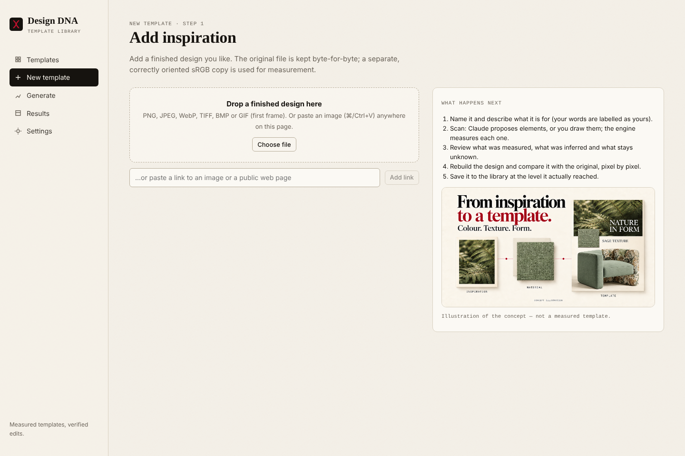

**2. Scan it.** Click **Analyze with Claude** to get proposed boxes (needs a key), or **Draw element** to mark them
yourself. Review each box, then **Measure accepted elements**. The engine measures colours, fonts, sizes and
positions. The right column shows what was measured, observed or inferred, and what stays unknown.

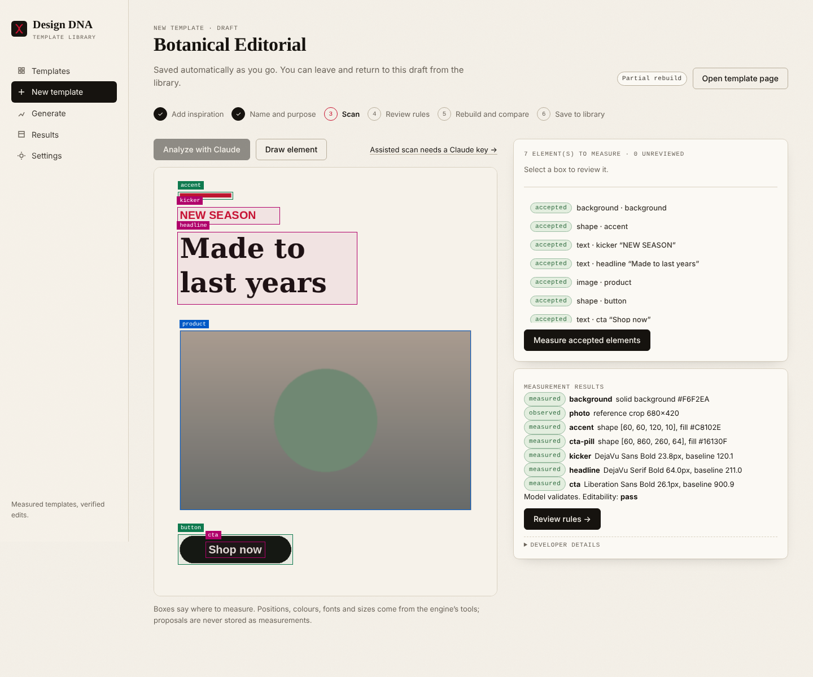

**3. Decide what can change.** In **Review rules**, mark slots required, set character and line limits, set
default copy and locks, then confirm that you reviewed the findings.

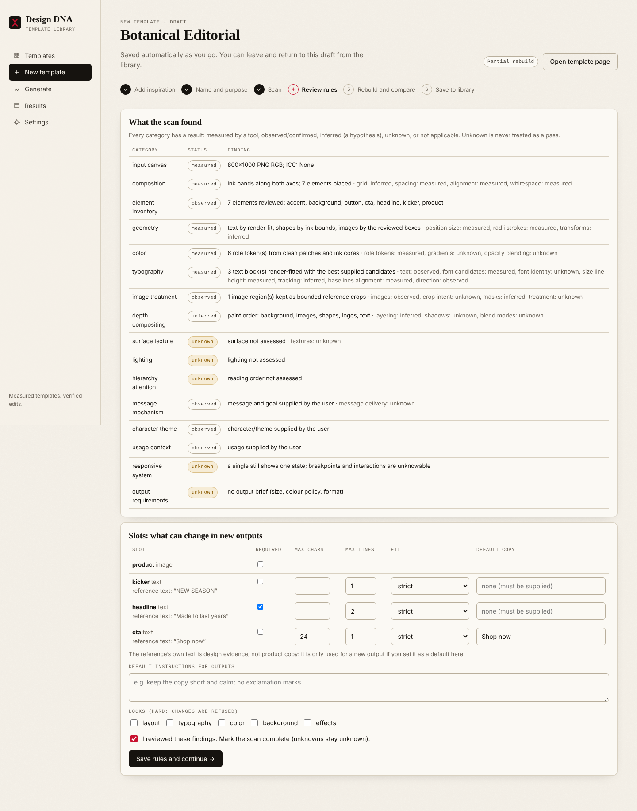

**4. Rebuild and compare.** The engine renders the model in its pinned browser and compares it with the original.
Then it renders again in a fresh process to prove the result reproduces. Save it at the level it actually reached:
`exact_pixels`, `editable_close` or `partial_baseline`. A partial rebuild can still be used, with its limitations
shown.

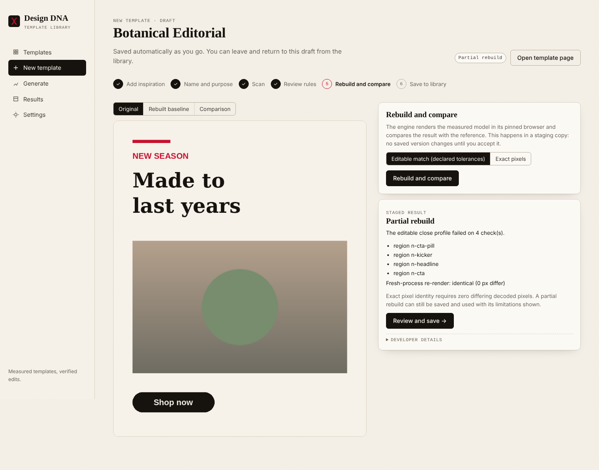

**5. Use the library.** Search, filter, collect and select templates. The template page shows the passport,
elements, palette, typography, scan coverage, versions and what each generation mode can claim.

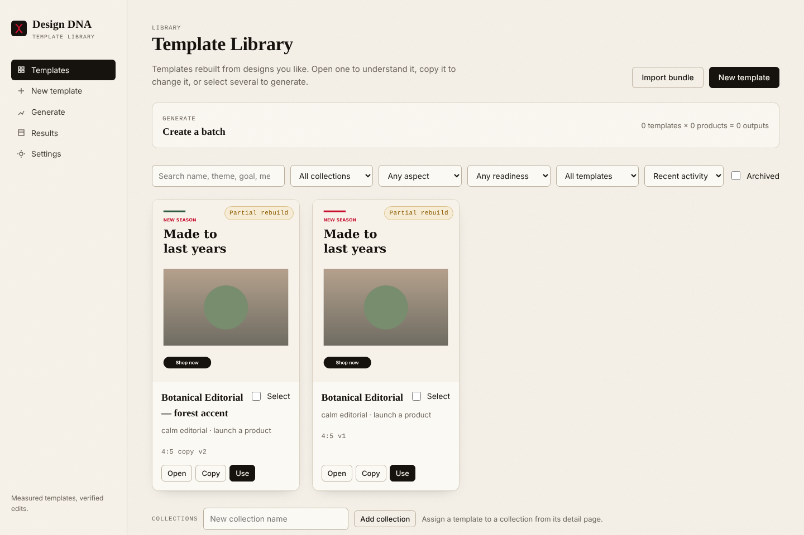
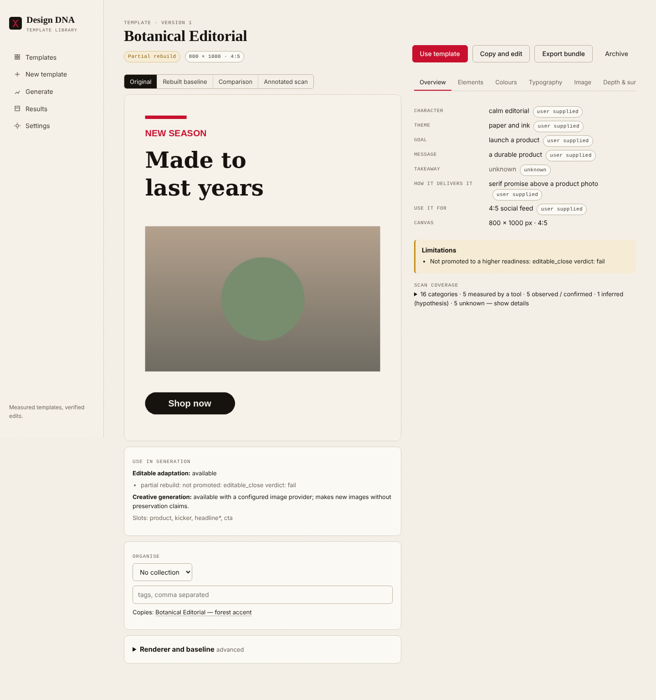

**6. Copy and edit.** Originals are read-only. **Copy and edit** makes a new template. Describe a change ("make the
accent #2E5A44"), preview its scope, and apply it. Every edit is verified in the pinned renderer, with
`0 px outside influence` required, and becomes a revision. Save it as a new version when you're happy with it.

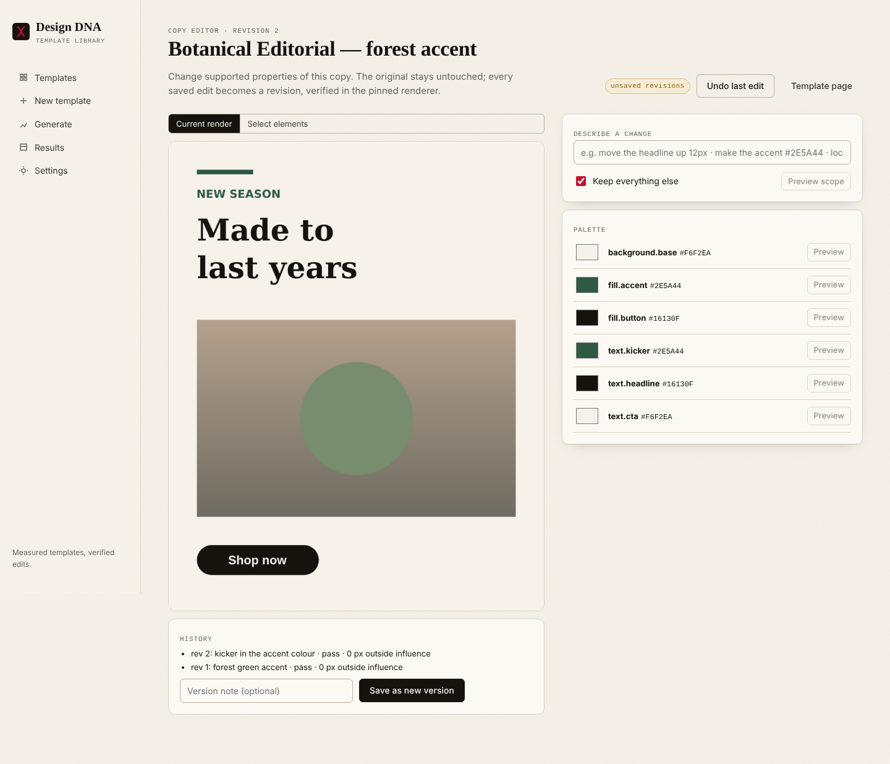

**7. Add products and control each output.** Select templates and products. Each product × template pair gets its
own editor: copy per slot, mode (editable adaptation, creative generation, or a generated photo inside the
template), language and instructions. **Check fit & preview** renders the pair before you submit. Copy that doesn't
fit is refused with options; it is never clipped or shrunk silently.

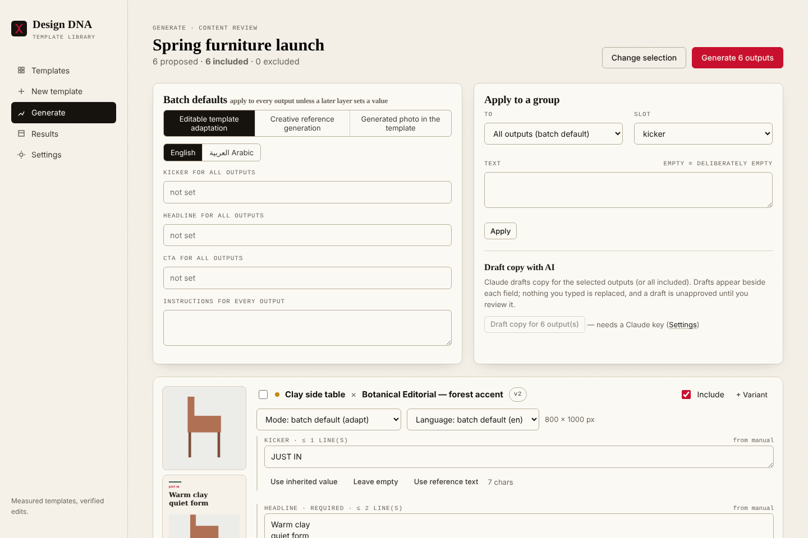

**8. Generate and review.** Submitting freezes each output's template version and inputs, so later template edits
don't change queued or finished outputs. Results show each output's status and checks. Approve, retry with
revised copy (as a new revision; the original is kept) or cancel.

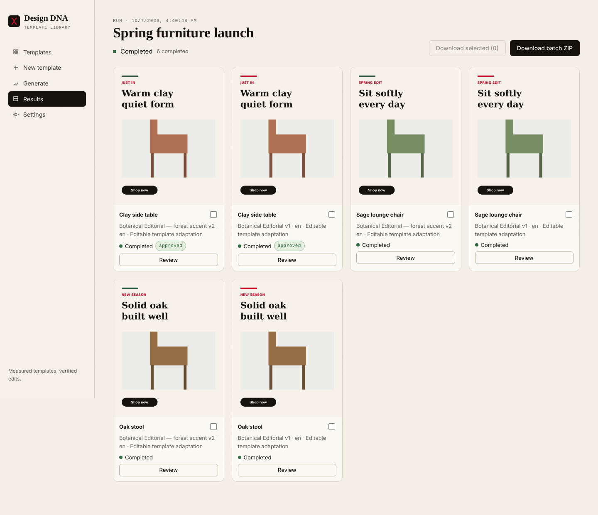

**9. Download and continue later.** Download single PNG/SVG files or a ZIP with a manifest. Export a template as a
`.dnab` bundle and import it into any other workspace. Drafts, batches and unsent copy are saved, so you can close
the tab and come back.

**Settings** shows what this installation can do right now: provider status, renderer, limits and the font library.

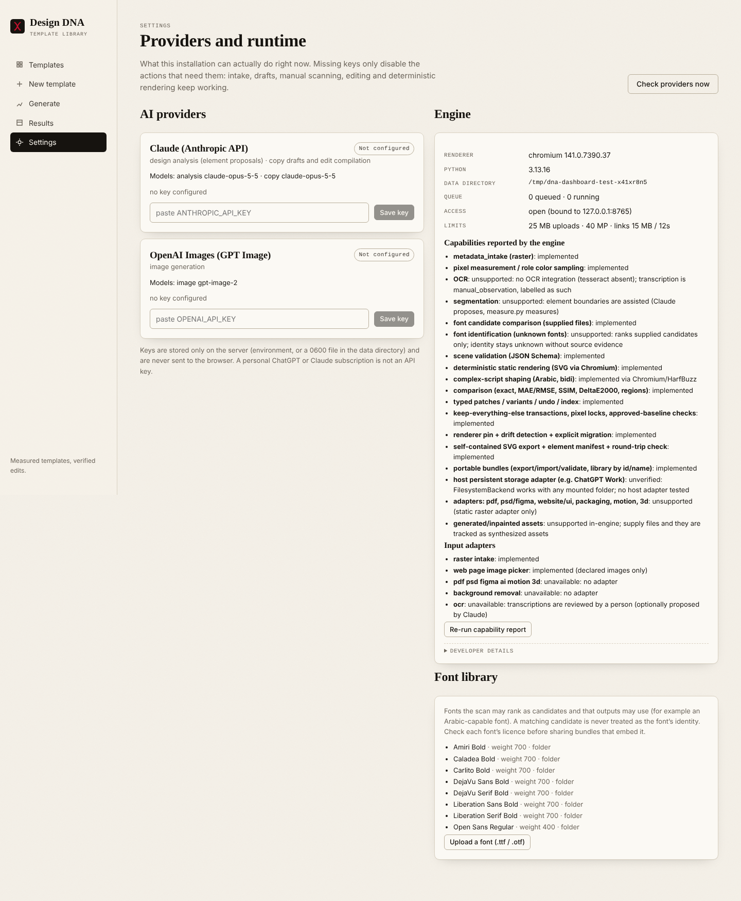

The app works on a phone-width screen and by keyboard (skip link, labelled controls, visible focus).

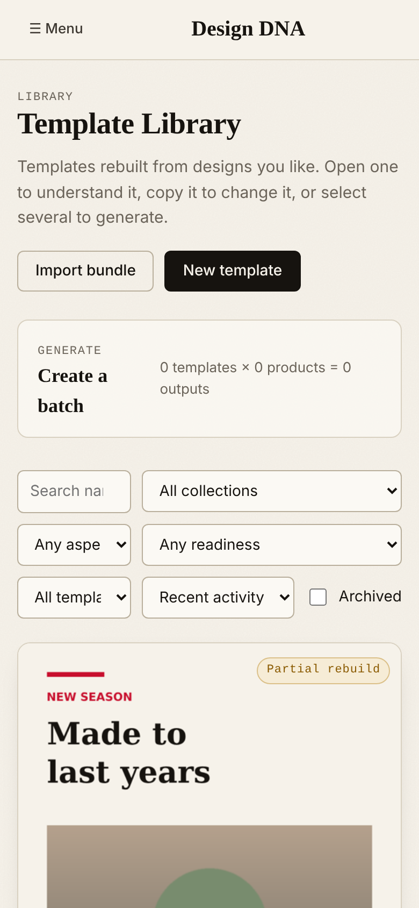 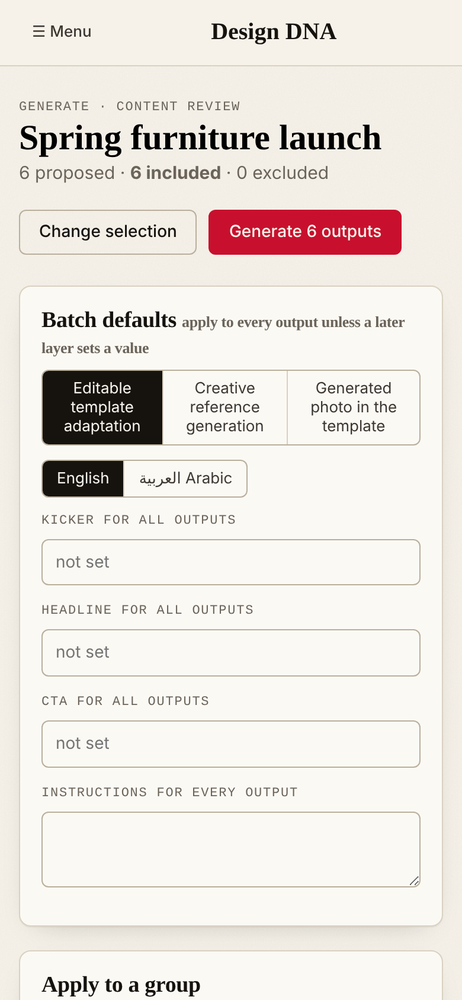

## Tests

```bash
(cd dashboard/web && npm ci && npm run build)
cd dashboard/tests
python -m unittest -v test_intake test_templates test_batches test_execution test_ui
```

The tests use the real engine, a real Chromium, a real worker process (killed mid-job for the recovery tests) and
the **test-only mock providers**. The mock providers are never a production path, and live provider calls are not
part of the suite. `DNA_TEST_EVIDENCE=<dir>` keeps each scenario's key results in `results.jsonl`. CI:
`.github/workflows/dashboard.yml`.
